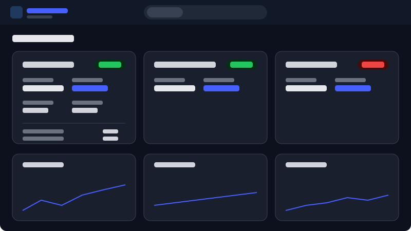
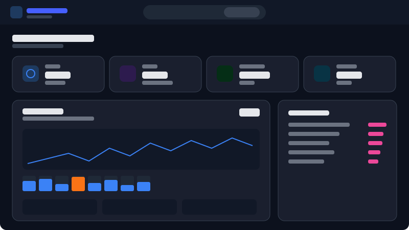

# Torrent Dashboard + Hardware Monitor

Personal dashboard to track private torrent tracker stats and monitor your hardware in real-time.

<p align="center">
  
</p>

<p align="center">
  
</p>

> **Live Demo** — Deploy the frontend to Vercel with `NEXT_PUBLIC_DEMO=true` to get an interactive preview with mock data (no backend required).

## Features

**Tracker Stats**
- Ratio, buffer, upload/download, bonus points for each tracker
- History charts (ratio, buffer) over 30 days
- Support for UNIT3D, Sharewood, and custom scrapers
- Quick links to bonus shops
- Automatic scraping at fixed times (configurable)

**Hardware Monitor**
- CPU: load, temperature, power, frequency, fan speed, per-core load
- GPU: load, temperature, VRAM, power, fan speed
- RAM: real-time usage
- Storage: disk space, HDD/NVMe temperatures
- Network: upload/download in real-time
- System uptime

## Architecture

```
[Local PC]                      [VPS]
hw-agent ──WebSocket──> Nginx ──> Backend (FastAPI)
                                     ├── PostgreSQL
                                     ├── Scrapers (Playwright)
                                     └── REST API + WebSocket
                                  Nginx ──> Frontend (Next.js)
```

- **Backend**: FastAPI, async SQLAlchemy, JWT auth, WebSocket
- **Frontend**: Next.js with TailAdmin, ApexCharts, dark/light mode
- **Scrapers**: Playwright headless (Chromium), UNIT3D + Sharewood
- **HW Agent**: Python script (psutil, nvidia-smi, LibreHardwareMonitor WMI)
- **Infra**: Docker Compose, Nginx reverse proxy, Let's Encrypt SSL

## Prerequisites

- **Server/VPS** with Docker and Docker Compose
- **Nginx** as reverse proxy (with SSL via Let's Encrypt)
- **Python 3.10+** on local PC (for hw-agent)
- **LibreHardwareMonitor** running on PC (for CPU/disk temperatures)
- Accounts on the private trackers you want to monitor

## Quick Start

### 1. Clone

```bash
git clone https://github.com/BurN-30/dashboard-ratio.git
cd dashboard-ratio/dashboard-v2
```

### 2. Configure

```bash
cp .env.example .env
# Edit .env with your credentials
```

Key variables:

| Variable | Description |
|----------|-------------|
| `DATABASE_URL` | PostgreSQL URL |
| `JWT_SECRET` | JWT secret key (generate with `openssl rand -hex 32`) |
| `ADMIN_PASSWORD` | Dashboard admin password |
| `DOMAIN` | Your domain (e.g. `dashboard.example.com`) |
| `HW_AGENT_TOKEN` | Hardware agent token (generate with `openssl rand -hex 16`) |
| `TRACKER_USERNAME` | Your tracker username (for shop links) |
| `SW_USER/PASS` | Sharewood credentials |
| `GF_USER/PASS` | Generation-Free credentials |
| `TOS_USER/PASS` | TheOldSchool credentials |

### 3. Deploy with Docker

```bash
docker compose -f docker-compose.simple.yml up -d
```

Containers expose ports on `127.0.0.1` only. Configure Nginx to proxy:
- `dash.yourdomain.com` -> `localhost:3000` (frontend)
- `api.yourdomain.com` -> `localhost:8000` (backend)

### 4. Launch Hardware Agent (local PC)

```bash
cd hw-agent
cp .env.example .env
# Edit .env with WS_URL and HW_AGENT_TOKEN

python -m venv venv
venv\Scripts\activate  # Windows
pip install -r requirements.txt
python agent.py
```

The agent connects via WebSocket and sends hardware stats every 2 seconds.

## Demo / Preview Mode

The frontend supports a **demo mode** for previewing the UI without a backend:

```bash
cd dashboard-v2/frontend
NEXT_PUBLIC_DEMO=true npm run dev
```

Or deploy to Vercel with the environment variable `NEXT_PUBLIC_DEMO=true` for a public preview.

## Project Structure

```
dashboard-v2/
├── backend/                # FastAPI API
│   ├── app/
│   │   ├── main.py         # Entry point, CORS, startup
│   │   ├── config.py       # Configuration (Pydantic Settings)
│   │   ├── database.py     # Async SQLAlchemy
│   │   ├── models.py       # DB models
│   │   ├── auth/           # JWT auth + rate limiting
│   │   ├── api/            # REST routes (tracker stats)
│   │   ├── hardware/       # WebSocket hardware monitoring
│   │   └── scrapers/       # Playwright scrapers + scheduler
│   ├── Dockerfile
│   └── requirements.txt
├── frontend/               # Next.js dashboard
│   ├── src/
│   │   ├── app/            # Pages (/, /traffic, /hardware-monitor)
│   │   ├── components/     # UI components
│   │   ├── hooks/          # Custom hooks (useHardwareStats, etc.)
│   │   └── lib/            # API client, demo data, auth utils
│   └── Dockerfile
├── hw-agent/               # Hardware monitoring agent
│   ├── agent.py            # Collects stats + sends via WebSocket
│   └── requirements.txt
├── docker-compose.simple.yml  # Production (Nginx proxy)
├── docker-compose.dev.yml     # Local development
└── .env.example               # Configuration template
```

## Security

- JWT auth on all API routes and WebSocket endpoints
- Rate limiting on `/auth/login` (5 attempts/min/IP)
- CORS configured per domain (no wildcard)
- Docker ports exposed on `127.0.0.1` only
- Hardware agent authenticated by token
- No secrets in source code (everything via `.env`)

## License

MIT
