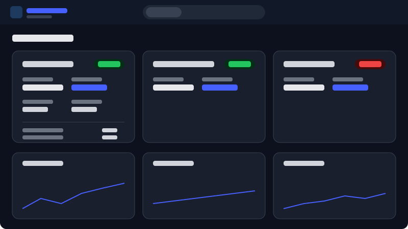
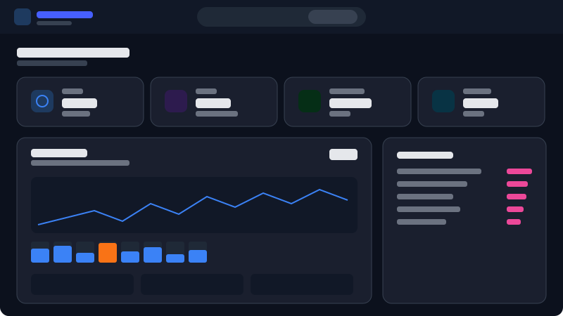

# TrackBoard

Dashboard personnel pour suivre les stats de trackers torrent privés et monitorer son hardware en temps réel.

<p align="center">
  
</p>

<p align="center">
  
</p>

## Fonctionnalités

**Statistiques Trackers**
- Ratio, buffer, upload/download, bonus points par tracker
- Graphiques d'historique sur 30 jours
- Support UNIT3D (Generation-Free, TheOldSchool, Gemini), Torr9
- Liens rapides vers les boutiques bonus
- Scraping automatique à 8h/14h/20h (Europe/Paris)

**Monitoring Hardware (PC local)**
- CPU : charge, température, puissance, fréquence, ventilateur, charge par cœur
- GPU : charge, température, VRAM, puissance, ventilateur (NVIDIA via `nvidia-smi`)
- RAM : utilisation en temps réel
- Stockage : espace disque, températures HDD/NVMe (LibreHardwareMonitor WMI)
- Réseau : upload/download en temps réel
- Uptime système

**Services média (optionnels)**
- Vue agrégée Plex / Radarr / Sonarr / Tautulli (URLs configurables, accessibles depuis le backend)

## Architecture

```
┌─ PC Local ─────────┐                                ┌─ VPS ───────────────────────┐
│                    │                                │                             │
│  hw-agent (auto    │ ──── WSS ────────────────────► │  Backend FastAPI            │
│  start Win Task    │                                │   ├── PostgreSQL            │
│  Scheduler SYSTEM) │                                │   ├── Scrapers (Playwright) │
│                    │                                │   └── Hardware WS hub       │
│  Plex / Radarr /   │                                │                             │
│  Sonarr / Tautulli │ ◄── HTTP via Cloudflare ────── │  Backend (media routes)     │
│  (LAN local)       │      Tunnel                    │                             │
│                    │                                │  Frontend (Next.js)         │
└────────────────────┘                                │                             │
                                                      │  Reverse proxy host         │
       navigateur ──── HTTPS ──────────────────────► │   (nginx/caddy)             │
                                                      │   ├── dash.DOMAIN -> :3000  │
                                                      │   └── api.DOMAIN  -> :8000  │
                                                      └─────────────────────────────┘
```

Le frontend et le backend sont servis sur **deux sous-domaines distincts** (multi-origin) via un reverse proxy host (nginx ou Caddy installé directement sur le serveur, pas dans le compose).

| Composant | Stack |
|-----------|-------|
| **Backend** | FastAPI, async SQLAlchemy, JWT, WebSocket |
| **Frontend** | Next.js 16, Tailwind CSS 4, ApexCharts |
| **DB** | PostgreSQL 16 |
| **Scrapers** | Playwright headless Chromium |
| **HW Agent** | Python (psutil, nvidia-smi, LibreHardwareMonitor via WMI) |
| **Reverse proxy** | nginx ou Caddy installé sur le host (gère HTTPS et le multi-vhosts) |
| **Infra** | Docker Compose |

## Prérequis

- VPS avec Docker, Docker Compose
- Reverse proxy host installé (nginx ou Caddy) avec certificats SSL pour `dash.DOMAIN` et `api.DOMAIN`
- Deux sous-domaines pointant vers le VPS : `dash.${DOMAIN}` (frontend) et `api.${DOMAIN}` (backend)
- PC local pour l'agent hardware (Windows recommandé pour les températures via LibreHardwareMonitor)
- Comptes sur les trackers privés à monitorer

## Installation

### 1. Cloner

```bash
git clone <repo-url> trackboard
cd trackboard
```

### 2. Configurer

```bash
cp .env.example .env
nano .env  # remplir DOMAIN, JWT_SECRET, ADMIN_PASSWORD, HW_AGENT_TOKEN, credentials trackers...
```

Variables critiques :

| Variable | Description |
|----------|-------------|
| `DOMAIN` | Votre domaine de base (ex: `example.com`). Le reverse proxy host servira `dash.${DOMAIN}` et `api.${DOMAIN}` |
| `JWT_SECRET` | Clé JWT (générer avec `openssl rand -hex 32`) |
| `ADMIN_PASSWORD` | Mot de passe admin du dashboard |
| `HW_AGENT_TOKEN` | Token de l'agent hardware (`openssl rand -hex 16`) |
| `DATABASE_URL` | URL PostgreSQL (cohérente avec POSTGRES_*) |
| `POSTGRES_PASSWORD` | Mot de passe Postgres |
| `TRACKER_USERNAME` | Pseudo affiché dans les liens shop bonus |
| `GF_USER/PASS/USERNAME` | Identifiants Generation-Free |
| `TOS_USER/PASS/USERNAME` | Identifiants TheOldSchool |
| `GEMINI_USER/PASS/USERNAME` | Identifiants Gemini Tracker |

### 3. Configurer le reverse proxy host

Exemple nginx (`/etc/nginx/sites-available/trackboard`) :

```nginx
# Frontend dashboard
server {
    server_name dash.example.com;
    listen 443 ssl;
    # ... SSL via Let's Encrypt (certbot --nginx)

    location / {
        proxy_pass http://127.0.0.1:3000;
        proxy_http_version 1.1;
        proxy_set_header Upgrade $http_upgrade;
        proxy_set_header Connection "upgrade";
        proxy_set_header Host $host;
        proxy_set_header X-Real-IP $remote_addr;
        proxy_set_header X-Forwarded-For $proxy_add_x_forwarded_for;
        proxy_set_header X-Forwarded-Proto $scheme;
        proxy_cache_bypass $http_upgrade;
    }
}

# Backend API + WebSocket hardware
server {
    server_name api.example.com;
    listen 443 ssl;
    # ... SSL via Let's Encrypt

    location / {
        proxy_pass http://127.0.0.1:8000;
        proxy_http_version 1.1;
        proxy_set_header Upgrade $http_upgrade;
        proxy_set_header Connection "upgrade";
        proxy_set_header Host $host;
        proxy_set_header X-Real-IP $remote_addr;
        proxy_set_header X-Forwarded-For $proxy_add_x_forwarded_for;
        proxy_set_header X-Forwarded-Proto $scheme;
        proxy_read_timeout 86400;     # WebSocket long polling
    }
}
```

### 4. Déployer

```bash
docker compose up -d
docker compose logs -f
```

Les containers exposent leurs ports sur `127.0.0.1` uniquement. Le reverse proxy host les proxifie publiquement.

### 5. Lancer l'agent hardware (PC local)

**Setup automatique recommandé** : utiliser le script PowerShell d'installation Task Scheduler (auto-start au boot, restart si crash, tourne en compte SYSTEM) :

```powershell
# Sur le PC local, en PowerShell admin :
cd hw-agent
powershell.exe -ExecutionPolicy Bypass -File ..\scripts\install-hw-agent-task.ps1
```

**Setup manuel** :

```bash
cd hw-agent
cp .env.example .env
# Configurer WS_URL=wss://api.votre-domaine.com/hardware/ws/agent
# et HW_AGENT_TOKEN (même valeur que dans le .env du serveur)

python -m venv venv
venv\Scripts\activate          # Windows
# source venv/bin/activate     # Linux/Mac
pip install -r requirements.txt
python agent.py
```

L'agent envoie les stats hardware toutes les 2 secondes via WebSocket.

### 6. Première connexion aux trackers (cookies)

Le scraper utilise des cookies persistants pour éviter de re-login à chaque scrape (et pour passer les captchas anti-bot type Gemini). Capture les cookies depuis le VPS :

```bash
docker compose exec backend python capture_cookies.py "GF-FREE" "https://generation-free.org/login"
```

Un Chromium s'ouvre, login manuellement, ferme l'onglet — les cookies sont sauvegardés dans le volume `cookies-data`.

## Mode démo (sans backend)

Pour prévisualiser l'interface avec des données fictives :

```bash
cd frontend
NEXT_PUBLIC_DEMO=true npm run dev
```

Pour publier une démo en ligne (ex: Vercel), utiliser un nom de projet **anonyme** afin de ne pas exposer d'identité dans l'URL générée.

## Développement local

```bash
# Backend + DB en Docker
docker compose -f docker-compose.dev.yml up -d

# Frontend en local (dans un autre terminal)
cd frontend
cp .env.local.example .env.local   # garde NEXT_PUBLIC_API_URL=http://localhost:8000
npm install
npm run dev
```

Le backend dev tourne sur `http://localhost:8000` (sans HTTPS, sans reverse proxy), le frontend sur `http://localhost:3000`.

## Migrations de schéma (Alembic)

Alembic est configuré pour gérer les changements de schéma sans perdre l'historique. Voir `backend/alembic/README.md` pour la procédure de bootstrap et le workflow.

## Structure du projet

```
trackboard/
├── backend/                    # API FastAPI
│   ├── app/
│   │   ├── main.py             # Point d'entrée, CORS, lifespan
│   │   ├── config.py           # Pydantic Settings
│   │   ├── health.py           # Healthchecks honnêtes (DB, scheduler, agent...)
│   │   ├── logging_config.py
│   │   ├── auth/               # JWT + rate limiting
│   │   ├── api/                # Routes REST (stats, history)
│   │   ├── hardware/           # WebSocket hub hardware
│   │   ├── media/              # Plex / Radarr / Sonarr / Tautulli
│   │   ├── scrapers/           # Playwright + scheduler
│   │   └── db/                 # SQLAlchemy async
│   ├── alembic/                # Migrations DB
│   ├── tests/
│   ├── capture_cookies.py      # Capture manuelle des cookies trackers
│   ├── Dockerfile              # Production
│   ├── Dockerfile.dev          # Hot reload
│   └── requirements.txt
├── frontend/                   # Next.js
│   ├── src/
│   │   ├── app/                # Pages routées
│   │   ├── components/         # UI (tracker, hardware, common)
│   │   ├── context/            # Auth, Theme, Toast
│   │   ├── hooks/              # useHardwareStats
│   │   └── lib/                # Client API + données démo
│   └── Dockerfile
├── hw-agent/                   # Agent hardware (PC local)
│   ├── agent.py                # psutil + nvidia-smi + LHM WMI
│   └── requirements.txt
├── scripts/                    # Outillage operationnel
│   ├── diagnose.sh                  # Diag complet du VPS (SSH)
│   ├── install-hw-agent-task.ps1    # Auto-start hw-agent en Task Scheduler Win
│   └── fix-cloudflare-tunnel.ps1    # Repare cloudflared service config path
├── docker-compose.yml          # Production (DB + back + front)
├── docker-compose.dev.yml      # Dev local (DB + back hot reload)
├── deploy_to_ovh.sh            # Helper rsync deploy
└── .env.example
```

## Sécurité

- JWT sur toutes les routes API et WebSocket
- Rate limiting sur `/auth/login` (5 tentatives/min/IP)
- Conteneurs DB/back/front exposés uniquement sur `127.0.0.1` (le reverse proxy host fait la passerelle publique)
- Agent hardware authentifié par token séparé
- CORS configuré par domaine (pas de wildcard)
- Aucun secret dans le code source (tout via `.env`, déjà gitignored)
- `/health` public minimal, `/health/full` derrière auth pour les détails techniques

## Licence

MIT
